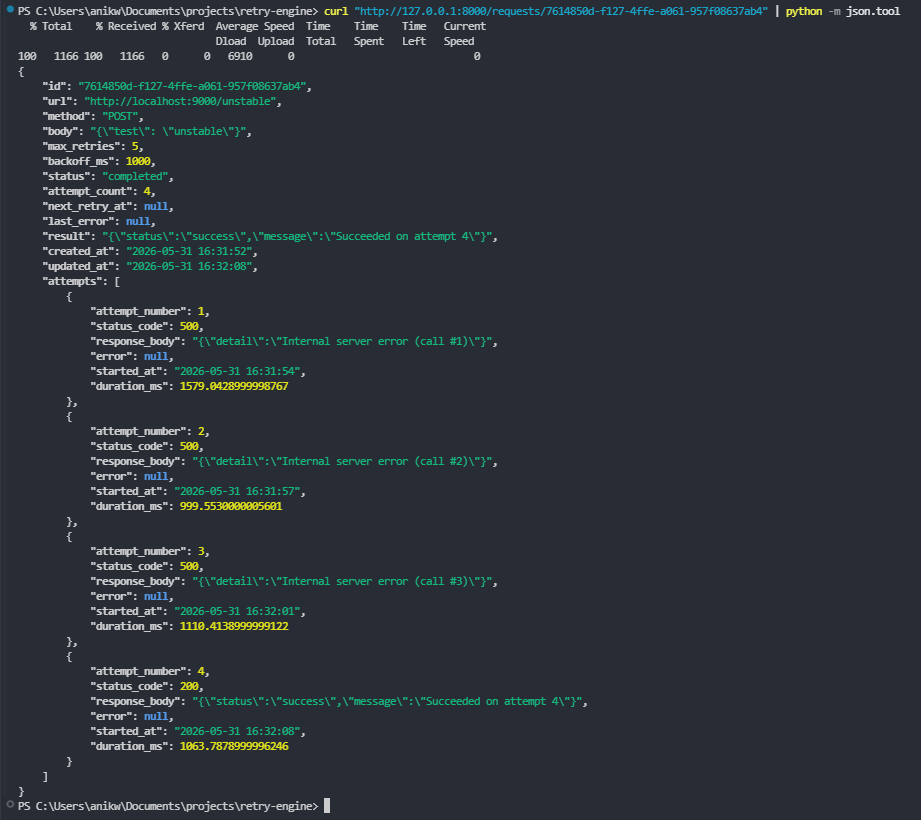

# Retry Engine

An HTTP service that retries failed outbound requests with exponential backoff and jitter. Built with Python, FastAPI, SQLite, and httpx.

When your service calls an external API — a payment gateway, an SMS provider, a bank — it sometimes fails. This engine queues those requests, retries them with increasing delays, and tracks every attempt so nothing gets silently lost.

## Setup

### Prerequisites

- Python 3.13+
- [uv](https://docs.astral.sh/uv/) (package manager)

### Install & Start

```bash
# Clone the repo
git clone https://github.com/kaosi-anikwe/retry-engine.git
cd retry-engine

# Install dependencies
uv sync

# Start the retry engine (port 8000)
uv run uvicorn app.main:app --port 8000
```

For testing, also start the mock server in a separate terminal:

```bash
# Start the mock external service (port 9000)
uv run uvicorn mock_server:app --port 9000
```

Then run the automated test script:

```bash
uv run python test_retry.py
```

### curl Commands

**Submit a request:**

```bash
curl -X POST http://localhost:8000/request \
  -H "Content-Type: application/json" \
  -d '{
    "url": "http://localhost:9000/unstable",
    "method": "POST",
    "body": {"key": "value"},
    "maxRetries": 5,
    "backoffMs": 1000
  }'
```

Response: `{"id": "uuid-here", "status": "pending"}`

**Get a request with attempt history:**

```bash
curl http://localhost:8000/requests/<request-id>
```

**List all requests:**

```bash
curl http://localhost:8000/requests
```

**Filter by status:**

```bash
curl "http://localhost:8000/requests?status=failed"
curl "http://localhost:8000/requests?status=completed"
curl "http://localhost:8000/requests?status=retrying"
```

## Architecture

```
┌────────┐     POST /request      ┌───────────┐
│ Client │ ──────────────────────►│  FastAPI  │
│        │ ◄────── {id, pending}──│  Server   │
└────────┘                        └─────┬─────┘
                                        │ INSERT
                                        ▼
                                  ┌────────────┐
                                  │  SQLite    │
                                  │ ┌────────┐ │
                                  │ │requests│ │
                                  │ │attempts│ │
                                  │ └────────┘ │
                                  └─────┬──────┘
                                        │ SELECT WHERE
                                        │ next_retry_at <= now()
                                        ▼
                              ┌──────────────────┐
                              │  Background      │
                              │  Worker (~500ms) │
                              └────────┬─────────┘
                                       │ HTTP request
                                       ▼
                              ┌──────────────────┐
                              │ External Service │
                              │ (payment, SMS...)│
                              └──────────────────┘
```

**Flow:**

1. Client submits a request via `POST /request`. It's saved to SQLite with status `pending` and the client gets back the ID immediately.
2. A background worker loop runs every ~500ms. It queries for rows where `status` is `pending` or `retrying` and `next_retry_at` has passed.
3. The worker makes the HTTP call to the external service.
4. On **success** (2xx): marks `completed`, stores the response.
5. On **4xx**: marks `failed` immediately — these are client errors that won't fix themselves.
6. On **5xx / timeout / network error**: schedules the next retry with exponential backoff + jitter. If `maxRetries` is exhausted, the request is dead-lettered as `failed`.

## Core Concepts

### Why Exponential Backoff?

When an external service goes down, the worst thing you can do is hammer it with retries every second. If 1,000 clients are all retrying at the same fixed interval, the service gets hit with a wall of traffic the moment it tries to recover — the [thundering herd problem](https://en.wikipedia.org/wiki/Thundering_herd_problem). It goes right back down.

Exponential backoff fixes this by increasing the delay between retries: 1s, 2s, 4s, 8s, 16s. Each failed attempt doubles the wait. This gives the downstream service breathing room to recover. The longer it's been down, the less pressure you put on it.

### Why Jitter?

Backoff alone isn't enough. If 100 requests all start at the same time with the same backoff schedule, they'll all retry at the exact same moments — 1s, 2s, 4s — creating synchronized spikes. Jitter adds randomness to spread retries out. Each attempt multiplies the delay by a random factor in `[0.8, 1.2)`, so a 4s base delay becomes somewhere between 3.2s and 4.8s. The retries naturally desynchronize.

### Why Not Retry 4xx?

A `4xx` status code means the client made a mistake — bad URL, invalid payload, unauthorized. Retrying it with the exact same request will produce the exact same error. It's a waste of resources and can mask bugs. Only transient failures (5xx, timeouts, network errors) are worth retrying because the problem is on the other end and likely temporary.

## Screenshot

> **`GET /requests/:id`** — a request that failed 3 times and then succeeded:



## What I Struggled With

- SQLite row types with aiosqlite not causing mypy issues
- Getting the timing right so the worker picks up due rows correctly

## What I Learned

- How aiosqlite wraps blocking SQLite calls in a thread for async use
- The difference between exponential backoff and fixed-interval retries in practice
- Using WAL mode in SQLite for better concurrent read/write performance

## Resources

- [AWS Architecture Blog — Exponential Backoff and Jitter](https://aws.amazon.com/blogs/architecture/exponential-backoff-and-jitter/)
- [aiosqlite documentation](https://aiosqlite.omnilib.dev/)
- [SQLite WAL Mode](https://sqlite.org/wal.html)

## Why This Made Me a Better Backend Developer

- I now understand why payment APIs have retry limits and backoff requirements in their docs -->
- I can design background workers that don't overwhelm downstream services
